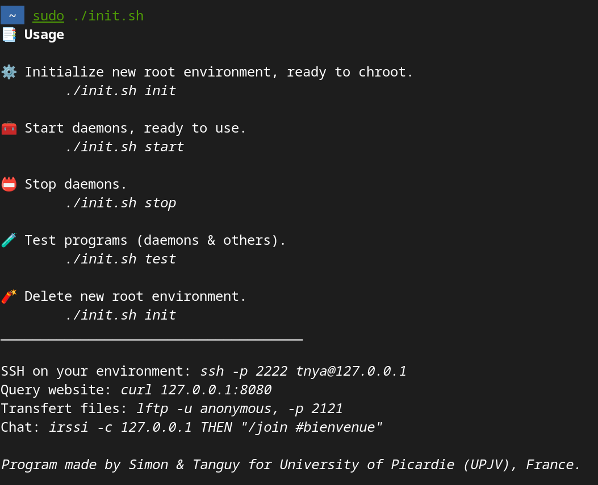

# ChrootableDirMaker

Generate chrootable directory with some packages with a user friendly script.  
Tested on Debian 12 (Linux 6.1.0-18-amd64).

*This script is not optimal and does not necessarily follow best practices. Its aim was to get us to manipulate the chroot command.*

Just start script in root to see usage: `sudo ./ChrootDirMaker.sh` *(trust me, lol)*.

## Usage



## To use script, do

### Install dependancies

```shell
curl -sS https://deb.troglobit.com/pubkey.gpg | sudo apt-key add -
echo "deb [arch=amd64] https://deb.troglobit.com/debian stable main" | sudo tee /etc/apt/sources.list.d/troglobit.list

sudo apt update
sudo apt install -y curl lighttpd ngircd dropbear uftpd

sudo systemctl disable lighttpd
sudo systemctl disable ngircd
sudo systemctl disable dropbear
```

### Fill vars

Configure at least USER_TO_IMPORT, SSH_PUBKEY_FILE, SSH_PRIVKEY_FILE vars from script.

## Develop

If you add binary to list COMMANDS_TO_IMPORT, this may not be enough, and special treatment may be required. A part of the script (delimited by a comment) is dedicated to these special treatments.

## Mémo

*No need to execute commands; this section is useless.*

```shell
sudo mknod $ENV/dev/urandom c 1 9
sudo chmod 0666 $ENV/dev/urandom

sudo mknod $ENV/dev/ptmx c 5 2  # dropbear
sudo chmod 0666 $ENV/dev/ptmx

sudo mknod $ENV/dev/tty c 5 0
sudo chmod 0666 $ENV/dev/tty

sudo mkdir $ENV/dev/pts/ # dropbear
sudo mount -o bind /dev/pts $ENV/dev/pts/ # dropbear
```
